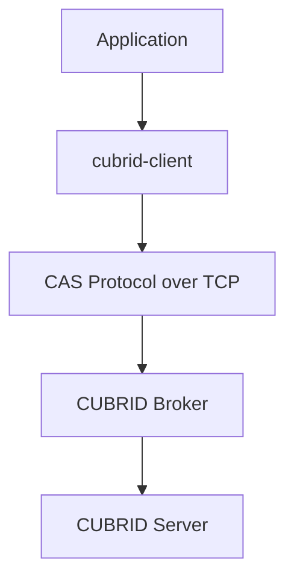
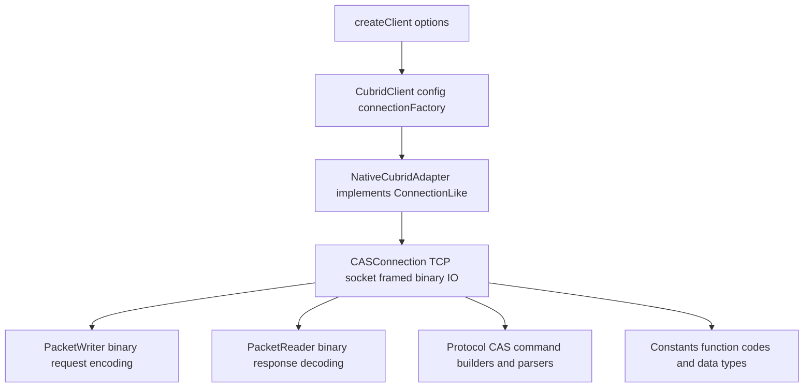
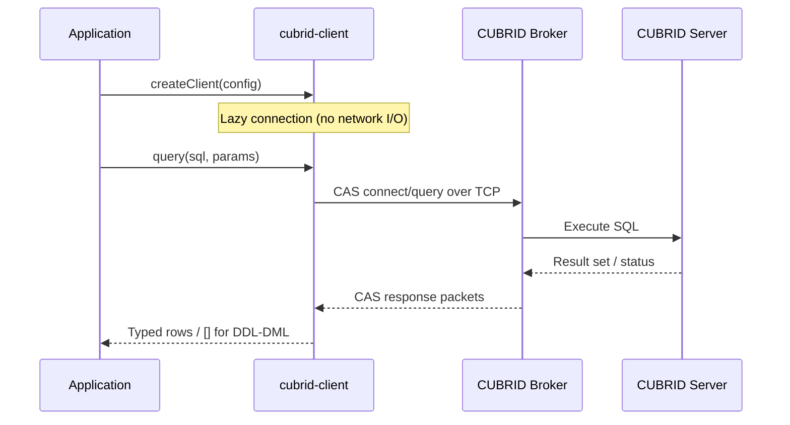
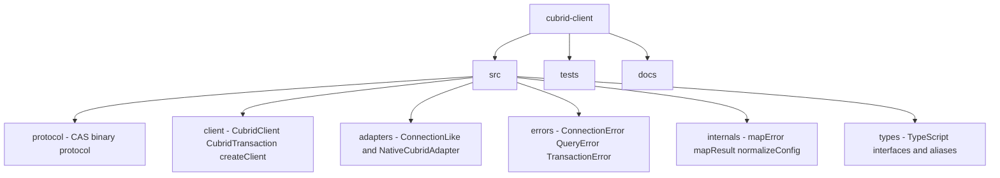

# cubrid-client

**Modern TypeScript-first Node.js client for the CUBRID database** — zero native dependencies, built-in CAS protocol driver, Promise-based API with full type safety.

<!-- BADGES:START -->
[](https://www.npmjs.com/package/cubrid-client)
[](https://nodejs.org)
[](https://github.com/cubrid-lab/cubrid-client/actions/workflows/ci.yml)
[](https://codecov.io/gh/cubrid-lab/cubrid-client)
[](https://github.com/cubrid-lab/cubrid-client/blob/main/LICENSE)
[](https://github.com/cubrid-lab/cubrid-client)
<!-- BADGES:END -->

## Why cubrid-client?

A modern CUBRID client that speaks the CAS binary protocol directly over TCP — no legacy driver dependencies, no native bindings.

| Feature | cubrid-client |
|---------|---------------|
| Protocol | Native CAS binary over TCP |
| Dependencies | Zero runtime dependencies |
| API style | Pure async/await |
| TypeScript | Full generics (`query<T>()`) |
| Results | `Record<string, unknown>[]` objects |
| Errors | `ConnectionError`, `QueryError`, `TransactionError` |
| Transactions | `transaction(callback)` with auto commit/rollback |
| Node.js | 18+ |

## Installation

```bash
npm install cubrid-client
```

No peer dependencies required.

**Requirements**: Node.js 18+, CUBRID 10.2+

## Quick Start

```ts
import { createClient } from "cubrid-client";

const db = createClient({
  host: "localhost",
  port: 33000,
  database: "demodb",
  user: "dba",
  password: "",
});

// Query returns an array of row objects
const rows = await db.query("SELECT * FROM athlete LIMIT 5");
console.log(rows);
// [{ code: 10000, name: 'Fernandez', ... }, ...]

await db.close();
```

## Typed Queries

Use TypeScript generics to get fully typed query results:

```ts
type Athlete = {
  code: number;
  name: string;
  gender: string;
  nation_code: string;
  event: string;
};

const athletes = await db.query<Athlete>(
  "SELECT * FROM athlete WHERE nation_code = ? LIMIT ?",
  ["KOR", 10],
);
// athletes is Athlete[] — full autocompletion and type safety
```

## Parameterized Queries

Use `?` placeholders to safely pass parameters:

```ts
// Positional parameters
const users = await db.query(
  "SELECT * FROM users WHERE name = ? AND age > ?",
  ["Alice", 25],
);

// Supported parameter types
await db.query("INSERT INTO data (a, b, c, d, e, f, g) VALUES (?, ?, ?, ?, ?, ?, ?)", [
  "text",              // string
  42,                  // number
  true,                // boolean
  9007199254740993n,   // bigint
  new Date(),          // Date
  Buffer.from("bin"),  // Buffer
  null,                // null
]);
```

### Date parameters are serialized in UTC

`Date` parameters are rendered as a `DATETIME'YYYY-MM-DD HH:MM:SS.mmm'`
literal using the date's **UTC** components (millisecond precision). CUBRID's
`DATETIME` type has no timezone, so the stored value reflects UTC wall-clock
time, not the client's local time. If you need local-time semantics, convert
the value yourself before passing it, or store an explicit UTC offset alongside
it.

### How parameters are escaped

Parameters are rendered into the SQL text client-side, with escaping that is
aware of the server's `no_backslash_escapes` setting. On first use, the client
probes the server (`SELECT CHAR_LENGTH('\\')`) and pins the correct mode for
the connection:

- **`no_backslash_escapes=yes`** (the CUBRID default): the backslash is an
  ordinary character. Only the single quote is doubled (`'` → `''`); backslashes,
  newlines, and carriage returns are preserved verbatim. This means a Windows
  path like `C:\temp\file.txt` round-trips unchanged.
- **`no_backslash_escapes=no`**: backslash-escape processing is active, so
  backslashes are doubled and `\r` / `\n` are backslash-escaped in addition to
  doubling the single quote.

> **Rejected bytes:** string parameters containing a NUL (`0x00`) or Ctrl-Z
> (`0x1A`) byte are rejected with a `QueryError`, because CUBRID cannot store a
> NUL in a string literal and defines no safe literal escape for `0x1A`. Encode
> such values as binary using a `Buffer` parameter (rendered as `X'..'`) instead.

## Transactions

### Automatic (Recommended)

`transaction()` creates an isolated connection, auto-commits on success, and auto-rolls back on error:

```ts
await db.transaction(async (tx) => {
  await tx.query("INSERT INTO orders (item, qty) VALUES (?, ?)", ["Widget", 1]);
  await tx.query(
    "UPDATE inventory SET qty = qty - 1 WHERE item = ?",
    ["Widget"],
  );
  // Auto-committed here
});
// If any query throws, everything is rolled back automatically.
```

### Manual

For fine-grained control on the shared connection:

```ts
await db.beginTransaction();
try {
  await db.query("INSERT INTO logs (msg) VALUES (?)", ["step 1"]);
  await db.query("INSERT INTO logs (msg) VALUES (?)", ["step 2"]);
  await db.commit();
} catch (error) {
  await db.rollback();
  throw error;
}
```

## TLS/SSL

Connect to an SSL-enabled CUBRID broker (`SSL=ON` in `cubrid_broker.conf`) by
setting the `ssl` option. Certificates are verified against the system trust
store by default (`rejectUnauthorized: true`), and the minimum negotiated
protocol is TLS 1.2.

```ts
// Simplest form: enable TLS with default certificate verification
const db = createClient({
  host: "localhost",
  database: "demodb",
  user: "dba",
  ssl: true,
});
```

For self-signed or private-CA broker certificates, pass an options object:

```ts
import { readFileSync } from "node:fs";

const db = createClient({
  host: "db.internal",
  database: "demodb",
  user: "dba",
  ssl: {
    ca: readFileSync("broker-ca.pem", "utf8"), // trust a private CA
    servername: "db.internal",                 // override SNI / cert hostname
    // rejectUnauthorized: false,               // opt out of verification (NOT recommended)
  },
});
```

`ClientSSLOptions` fields:

| Field | Type | Default | Description |
|-------|------|---------|-------------|
| `rejectUnauthorized` | `boolean` | `true` | Reject connections whose certificate cannot be verified |
| `ca` | `string \| Buffer \| Array` | *(system store)* | Trusted CA certificate(s) for verification |
| `servername` | `string` | `host` | Server name for SNI and certificate hostname checks |

> The client uses a STARTTLS-style upgrade on the same broker port (`33000`):
> it negotiates the CAS handshake, then upgrades the socket to TLS before the
> database login. The plaintext (non-SSL) path is unaffected when `ssl` is
> omitted or `false`.


## Error Handling

Every error includes the original driver error as `.cause`:

```ts
import { createClient, ConnectionError, QueryError, TransactionError } from "cubrid-client";

const db = createClient({ host: "localhost", database: "demodb", user: "dba" });

try {
  await db.query("SELECT * FROM nonexistent_table");
} catch (error) {
  if (error instanceof ConnectionError) {
    console.error("Connection failed:", error.message);
  } else if (error instanceof QueryError) {
    console.error("Query failed:", error.message);
    console.error("Driver error:", error.cause);
  } else if (error instanceof TransactionError) {
    console.error("Transaction failed:", error.message);
  }
}
```

## API Reference

### `createClient(options): CubridClient`

Creates a client instance. Connection is established lazily on first query.

| Option | Type | Default | Description |
|--------|------|---------|-------------|
| `host` | `string` | *(required)* | Server hostname |
| `port` | `number` | `33000` | Broker port |
| `database` | `string` | *(required)* | Database name |
| `user` | `string` | *(required)* | Database user |
| `password` | `string` | `""` | Password |
| `connectionTimeout` | `number` | — | Connection timeout (ms) |
| `ssl` | `boolean \| ClientSSLOptions` | `false` | Enable TLS. `true` for defaults, or an object for cert/verification control (see [TLS/SSL](#tlsssl)) |

### `client.query<T>(sql, params?): Promise<T[]>`

Executes SQL and returns typed row objects. DDL/DML statements return `[]`.

### `client.transaction<T>(callback): Promise<T>`

Runs `callback` in an isolated transaction with auto commit/rollback.

### `client.beginTransaction(): Promise<void>`

Starts a transaction on the shared connection.

### `client.commit(): Promise<void>`

Commits the active transaction on the shared connection.

### `client.rollback(): Promise<void>`

Rolls back the active transaction on the shared connection.

### `client.close(): Promise<void>`

Closes the shared connection. Safe to call multiple times.

> 📖 Full API documentation: [docs/API_REFERENCE.md](docs/API_REFERENCE.md)

## Architecture

`cubrid-client` implements the CUBRID CAS binary protocol directly over TCP sockets:







No external protocol drivers needed — the entire CAS handshake, query execution, and result parsing is implemented in TypeScript.

## Documentation

| Document | Description |
|----------|-------------|
| [API Reference](docs/API_REFERENCE.md) | Complete method signatures, type definitions, error classes |
| [Connection Guide](docs/CONNECTION.md) | Connection options, lazy connection, lifecycle, Docker setup |
| [Troubleshooting](docs/TROUBLESHOOTING.md) | Common errors, debugging tips, performance advice |
| [Architecture](docs/architecture.md) | Internal design and module responsibilities |

## Project Layout



## Development

```bash
git clone https://github.com/cubrid-lab/cubrid-client.git
cd cubrid-client
npm install
npm run build        # TypeScript compilation (tsup)
npm test             # Run offline tests
npm run test:coverage # Coverage report (99%+ statements)
npm run typecheck    # tsc --noEmit
```

### Integration Tests

Integration tests run against a live CUBRID server. They self-skip their
database-dependent cases when no server is reachable, so they are safe to run
anywhere. Point them at a running CUBRID broker on `127.0.0.1:33000` with a
database named `testdb` and user `dba` (empty password):

```bash
npm run test:integration              # DB-dependent cases self-skip if unreachable
```

> CI runs this step too, but no CUBRID server is provisioned there, so only the
> offline cases execute and a warning annotation is emitted. To exercise the full
> suite, run the command above against your own CUBRID instance.

## Ecosystem

| Package | Description |
|---------|-------------|
| [cubrid-client](https://github.com/cubrid-lab/cubrid-client) | TypeScript client (this package) |
| [drizzle-cubrid](https://github.com/cubrid-lab/drizzle-cubrid) | Drizzle ORM dialect for CUBRID |

## Roadmap

See [`ROADMAP.md`](ROADMAP.md) for this project's direction and next milestones.

For the ecosystem-wide view, see the [CUBRID Labs Ecosystem Roadmap](https://github.com/cubrid-lab/.github/blob/main/ROADMAP.md) and [Project Board](https://github.com/orgs/cubrid-lab/projects/2).

## Disclaimer

This project is part of [CUBRID Lab](https://github.com/cubrid-lab), an independent open-source initiative for CUBRID developer tooling, and is not affiliated with, sponsored by, or endorsed by CUBRID Corporation or the official CUBRID project.

## License

[MIT](LICENSE)
